# 🛡️ SENTINEL: Real-time Network Threat Monitor

> **Sistema de monitoreo de ciberseguridad y simulación de tráfico en tiempo real.**  
> *Una demostración de Ingeniería de Datos moderna, WebSockets y Arquitectura Escalable.*


## 📖 Descripción

**Sentinel** es un dashboard interactivo estilo "SOC" (Security Operations Center) que simula y visualiza el tráfico de red en tiempo real. El sistema es capaz de generar tráfico sintético, detectar patrones de ataques de Denegación de Servicio (DoS) utilizando ventanas de tiempo deslizantes y persistir amenazas críticas, todo ocurriendo en milisegundos.

Este proyecto no es solo visual; implementa patrones de arquitectura limpia, optimización de costos para nube (Serverless friendly) y manejo eficiente de conexiones asíncronas.

---

## 🏗️ Arquitectura del Sistema

El flujo de datos sigue una arquitectura de eventos en tiempo real orquestada por WebSockets.

```mermaid
graph TD
    User[💻 Usuario / Navegador] -- "WebSocket (WSS)" --> Frontend[⚛️ Next.js Frontend]
    Frontend -- "Start/Stop Commands" --> Backend[🐍 FastAPI Backend]
    
    subgraph "Backend Core (Clean Arch)"
        Orchestrator[⚙️ Simulation Orchestrator]
        Generator[🎲 Traffic Generator]
        Detector[🛡️ DoS Detector Service]
    end
    
    Backend --> Orchestrator
    Orchestrator --> Generator
    
    subgraph "Data Layer"
        Redis[(⚡ Upstash Redis)]
        SQL[(🐘 Supabase PostgreSQL)]
    end
    
    Orchestrator -- "Check Traffic Rate" --> Detector
    Detector -- "Sliding Window (ZSET)" --> Redis
    
    Orchestrator -- "If Anomaly Detected" --> SQL
    
    Orchestrator -- "JSON Stream" --> Frontend

```


## 🚀 Tecnologías Utilizadas

### Backend (Data Engineering & API)

*   **Python 3.10 + FastAPI:** Manejo asíncrono de alto rendimiento y WebSockets.
 *  
*   **Redis (Upstash):** Estructuras `ZSET` para algoritmos de *Sliding Window*.
*  
*   **PostgreSQL (Supabase):** Persistencia de datos con `JSONB` y `UUID`.
*  
*   **SQLAlchemy + Pydantic:** ORM y validación de esquemas robusta.
*  
*   **Clean Architecture:** Diseño modular (`API`, `Services`, `CRUD`).
*  

### Frontend (Visualización)


*   **Next.js 14:** Framework de producción y Server Components.
*   **Tailwind CSS:** Diseño UI estilo "Cyberpunk/SOC".
*   **Recharts:** Gráficas de rendimiento en tiempo real.
*   **Lucide React:** Iconografía técnica vectorial.

### Infraestructura & Despliegue


*   **Render:** Alojamiento del Backend (Web Service de larga duración).
*   **Vercel:** Despliegue optimizado del Frontend.
*   **Supabase & Upstash:** Bases de datos Serverless gestionadas.

## 🛠️ Instalación y Ejecución Local
> **Prerrequisitos**
Docker & Docker Compose
Node.js 18+

 1. Clonar el repositorio
 ```bash
git clone https://github.com/TU_USUARIO/sentinel.git
cd sentinel
```

2. Configurar Variables de Entorno
Crea un archivo .env en la carpeta backend/

```bash
# backend/.env
PROJECT_NAME="Sentinel"
# Para Docker Local
DATABASE_URL="postgresql://postgres:postgres@db:5432/network_watcher_local"
REDIS_URL="redis://redis:6379/0"
```
3. Ejecutar con Docker (Backend + DBs)

   ```bash
cd backend
docker-compose up --build
   ```

4. Ejecutar Frontend
   ```bash
cd ../frontend
npm install
npm run dev
   ```


## Autor: Felipe Higuera 
 

